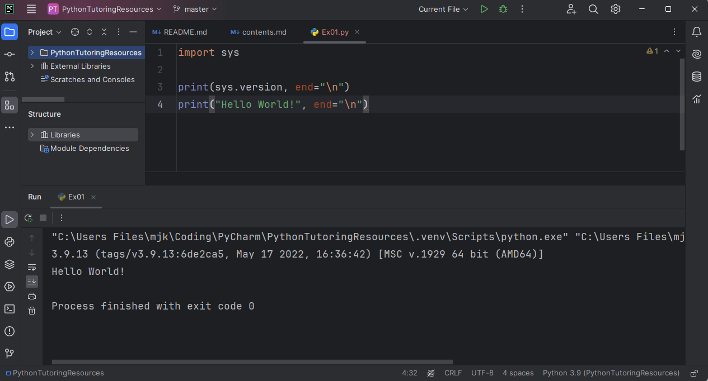

# 📜 PythonTutoringResources

## Preview

## Introduction

> 파이썬 기초 튜터링 자료.\
> "기초"의 범위는 "객체지향 프로그래밍"의 이전의 개념 까지로 정의.

## Index

> 수업 목차.

* **[Day #00](Day00/contents.md)**
    * 환경 설치, 설정(Python, VSCode)

* **[Day #01](Day01/contents.md)**
    * 함수_상(입출력); 정확한 설명은 [**함수-하**]에서 다룸
    * 자료형_상(숫자, 문자열, 불리언)

* **[Day #02](Day02/contents.md)**
    * 조건문(if)
    * 반복문(while)

* **[Day #03](Day03/contents.md)**
    * 자료형_하(딕셔너리, 리스트, 집합)
    * 반복문(for)

* **[Day #04](Day04/contents.md)**
    * 함수_하(사용자, 내장;입출력)

* **[Day #05](Day05/contents.md)**
    * 모듈(turtle, math)